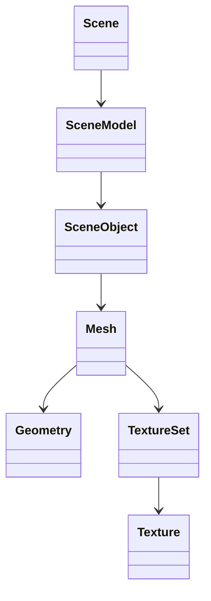
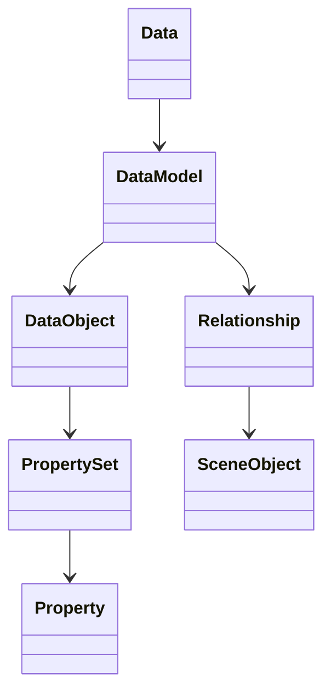
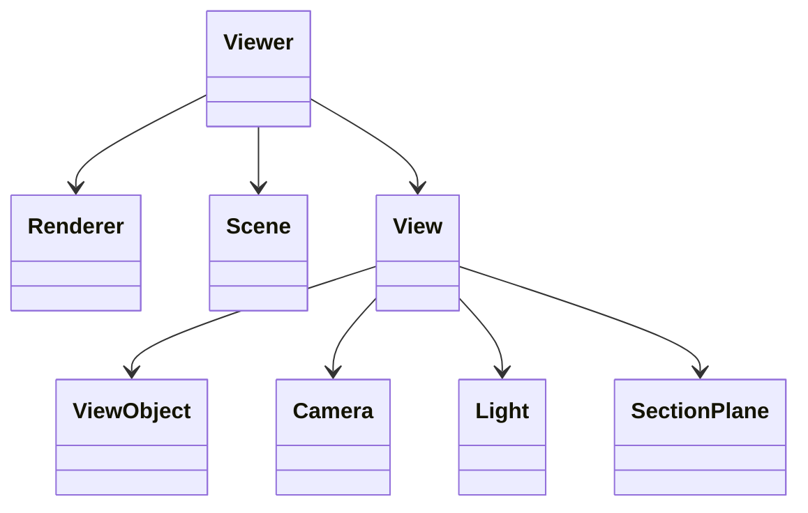

# @xeokit

*A complete graphics SDK for browser-based AECO model visualization.*

## Features

* Browser-based 3D/2D viewer
* Fast model loading
* Fast rendering
* Low memory footprint
* Multiple canvases
* Semantic ER data model
* Pluggable graphics engine (WebGL, WebGPU..)
* Natively TypeScript
* SOLID

## Modules


The xeokit SDK is modular and designed for maximum extensibility. Our philosophy is to rigorously follow SOLID
principles of software
design in order to keep the SDK comprehensive, extensible and robust.

### Model Representation and Semantics
    
The SDK manages model representation (geometry and materials) and model semantics (entities, relationships and
properties) in two separate, independent
data structures.

The SDK lets us just work with either of these model aspects independently. You're free to ignore our semantic model (an
ER graph), or
use a different one. We can use these structures with or without a viewer, in Browser or NodeJS. Use them to build
models, convert models
between various file formats, or provide some content for a viewer to render.

| Package                                                                  | Modules                                                               | Description                                                                  |
|--------------------------------------------------------------------------|-----------------------------------------------------------------------|------------------------------------------------------------------------------|
| [`@xeokit/data`](https://www.npmjs.com/package/@xeokit/data)             | [`@xeokit/data`](https://xeokit.github.io/sdk/docs/modules/_xeokit_data.html)                        | Entity-relationship graph that contains model semantic data.                 |
| [`@xeokit/scene`](https://www.npmjs.com/package/@xeokit/scene)           | [`@xeokit/scene`](https://xeokit.github.io/sdk/docs/modules/_xeokit_scene.html)                       | Scene graph that contains model representations (geometries, materials etc.) |



    


### Viewing Models

The SDK provides a high-performance Browser-based viewer for viewing our model representations.

The viewer is extensible via a pluggable renderer strategy to use different browser graphics APIs, such as WebGL or
WebGPU. The viewer can
view multiple models, and can create multiple views of our models in separate canvases, with lights, section planes,
annotations etc.

| Package                                                                  | Modules                                                               | Description                                          |
|--------------------------------------------------------------------------|-----------------------------------------------------------------------|------------------------------------------------------|
| [`@xeokit/viewer`](https://www.npmjs.com/package/@xeokit/viewer)         | [`@xeokit/viewer`](https://xeokit.github.io/sdk/docs/modules/_xeokit_viewer.html)                     | Browser-based model viewer                           |
| [`@xeokit/cameracontrol`](https://www.npmjs.com/package/@xeokit/cameracontrol)  | [`@xeokit/cameracontrol`](https://xeokit.github.io/sdk/docs/modules/cameracontrol.html)        | Interactive camera control for a viewer                     |
| [`@xeokit/webglrenderer`](https://www.npmjs.com/package/@xeokit/webglrenderer)  | [`@xeokit/webglrenderer`](https://xeokit.github.io/sdk/docs/modules/_xeokit_webglrenderer.html) | WebGL rendering strategy for a viewer       |
| [`@xeokit/treeview`](https://www.npmjs.com/package/@xeokit/treeview)     | [`@xeokit/treeview`](https://xeokit.github.io/sdk/docs/modules/_xeokit_treeview.html)                 | HTML tree view widget for a Viewer                          |
| [`@xeokit/locale`](https://www.npmjs.com/package/@xeokit/locale)     | [`@xeokit/treeview`](https://xeokit.github.io/sdk/docs/modules/_xeokit_locale.html)                 | Localization service for a viewer                         |



### Importing and Exporting Models

The SDK provides various functions to import and export its model representations and semantics as various
industry-standard AECO file formats. Use
these in NodeJS scripts to convert file formats, or in the Browser to load various file formats into our viewer.

| Package                                                              | Modules                                                                               | Description                |
|----------------------------------------------------------------------|---------------------------------------------------------------------------------------|----------------------------|
| [`@xeokit/xkt`](https://www.npmjs.com/package/@xeokit/xkt)           | [`@xeokit/xkt`](https://xeokit.github.io/sdk/docs/modules/_xeokit_xkt.html)           | Import and export XKT files |
| [`@xeokit/gltf`](https://www.npmjs.com/package/@xeokit/gltf)         | [`@xeokit/gltf`](https://xeokit.github.io/sdk/docs/modules/_xeokit_gltf.html)         | Import glTF files |
| [`@xeokit/las`](https://www.npmjs.com/package/@xeokit/las)           | [`@xeokit/las`](https://xeokit.github.io/sdk/docs/modules/_xeokit_las.html)           | Import LAS pointcloud scans |
| [`@xeokit/cityjson`](https://www.npmjs.com/package/@xeokit/cityjson) | [`@xeokit/cityjson`](https://xeokit.github.io/sdk/docs/modules/_xeokit_cityjson.html) | Import CityJSON files      |
| [`@xeokit/webifc`](https://www.npmjs.com/package/@xeokit/webifc)     | [`@xeokit/webifc`](https://xeokit.github.io/sdk/docs/modules/_xeokit_webifc.html)     | Import IFC files           |

### Interoperating with BIM Software

The SDK provides functions to share bookmarks of viewer state with other BIM software, as industry-standard *BCF
Viewpoints*. Use these to
build apps for collaborating on construction projects.

| Package                                                                  | Modules                                                               | Description                                          |
|--------------------------------------------------------------------------|-----------------------------------------------------------------------|------------------------------------------------------|
| [`@xeokit/bcf`](https://www.npmjs.com/package/@xeokit/bcf)               | [`@xeokit/bcf`](https://xeokit.github.io/sdk/docs/modules/_xeokit_bcf.html)                           | Load and save BCF                    |

### Utility Libraries

Most of the SDK's internal and lower-level functionality is provided as fully-documented utility libraries.

| Package                                                                  | Modules                                                               | Description                                          |
|--------------------------------------------------------------------------|-----------------------------------------------------------------------|------------------------------------------------------|
| [`@xeokit/core`](https://www.npmjs.com/package/@xeokit/core)             | [`@xeokit/core/components`](https://xeokit.github.io/sdk/docs/modules/_xeokit_core_components.html)   | Basic component types used throughout the xeokit SDK |
|                                                                          | [`@xeokit/core/constants`](https://xeokit.github.io/sdk/docs/modules/_xeokit_core_constants.html)     | Constants used throughout the xeokit SDK             |
|                                                                          | [`@xeokit/core/utils`](https://xeokit.github.io/sdk/docs/modules/_xeokit_core_utils.html)             | Core utilities used throughout the xeokit SDK        |
| [`@xeokit/datatypes`](https://www.npmjs.com/package/@xeokit/datatypes)   | [`@xeokit/datatypes/basicTypes`](https://xeokit.github.io/sdk/docs/modules/_xeokit_datatypes_basicTypes.html)  | Basic semantic data type constants  |
|                                                                          | [`@xeokit/datatypes/ifcTypes`](https://xeokit.github.io/sdk/docs/modules/_xeokit_datatypes_ifcTypes.html)      | IFC data type constants  |
| [`@xeokit/math`](https://www.npmjs.com/package/@xeokit/math)             | [`@xeokit/math/math`](https://xeokit.github.io/sdk/docs/modules/_xeokit_math_math.html)               | General math definitions and constants               |
|                                                                          | [`@xeokit/math/boundaries`](https://xeokit.github.io/sdk/docs/modules/_xeokit_math_boundaries.html)   | Boundaries math library                              |
|                                                                          | [`@xeokit/math/compression`](https://xeokit.github.io/sdk/docs/modules/_xeokit_math_compression.html) | Geometry de/compression utilities library            |
|                                                                          | [`@xeokit/math/curves`](https://xeokit.github.io/sdk/docs/modules/_xeokit_math_curves.html)           | Spline curves math library                           |
|                                                                          | [`@xeokit/math/geometry`](https://xeokit.github.io/sdk/docs/modules/_xeokit_math_geometry.html)       | Mesh generation functions                            |
|                                                                          | [`@xeokit/math/matrix`](https://xeokit.github.io/sdk/docs/modules/_xeokit_math_matrix.html)           | Matrix and vector math utilities library             |
|                                                                          | [`@xeokit/math/rtc`](https://xeokit.github.io/sdk/docs/modules/_xeokit_math_rtc.html)                 | Relative-to-center (RTC) coordinates math library    |
| [`@xeokit/webgl`](https://www.npmjs.com/package/@xeokit/webglutils)      | [`@xeokit/webglutils`](https://xeokit.github.io/sdk/docs/modules/_xeokit_webglutils.html)             | WebGL utilities library        |
| [`@xeokit/procgen`](https://www.npmjs.com/package/@xeokit/procgen)       | [`@xeokit/procgen/geometry`](https://xeokit.github.io/sdk/docs/modules/_xeokit_procgen_geometry.html) | Geometry generation functions                     |
| [`@xeokit/ktx2`](https://www.npmjs.com/package/@xeokit/ktx2)             | [`@xeokit/ktx2`](https://xeokit.github.io/sdk/docs/modules/_xeokit_ktx2.html)                         | Compressed texture support              |

## Quick Start

### Spinning Textured Box

Let's make a simple application using xeokit - a spinning, textured box.

First import the npm modules we need from the SDK:

````bash
npm install @xeokit/scene
npm install @xeokit/viewer
npm install @xeokit/webglrenderer
npm install @xeokit/core/constants
````

Here's the JavaScript for our spinning box app:

````javascript
import {Scene} from "@xeokit/scene";
import {TrianglesPrimitive, LinearEncoding, LinearFilter} from "@xeokit/core/constants";
import {Viewer} from "@xeokit/viewer";
import {WebGLRenderer} from "@xeokit/webglrenderer";

const scene = new Scene(); // Scene graph

const renderer = new WebGLRenderer({}); // WebGL renderer kernel

const viewer = new Viewer({ // Browser-base viewer
    scene,
    renderer
});

const view = myViewer.createView({ // Independent view 
    id: "myView",
    canvasId: "myView1"
});

view.camera.eye = [0, 0, 10]; // Looking down the -Z axis
view.camera.look = [0, 0, 0];
view.camera.up = [0, 1, 0];

const sceneModel = scene.createModel(); // Start building the scene graph

sceneModel.createGeometry({ // Define a box-shaped geometry
    id: "boxGeometry",
    primitive: TrianglesPrimitive,
    positions: [-1, -1, -1, 1, -1, -1, ...],
    uvs: [1, 0, 0, 0, 0, 1, 1, 1, 0, 0, 0, 1, ...],
    indices: [0, 1, 2, 0, 2, 3, 4, 5, 6, 4, ...]
});

sceneModel.createTexture({ // 
    id: "boxColorTexture",
    src: "myTexture.png",
    encoding: LinearEncoding,
    magFilter: LinearFilter,
    minFilter: LinearFilter
});

sceneModel.createTextureSet({
    id: "boxTextureSet",
    colorTextureId: "boxColorTexture"
});

sceneModel.createMesh({
    id: "boxMesh",
    geometryId: "boxGeometry",
    color: [1, 1, 1],
    metallic: 0.8, // PBR material attributes
    roughness: 0.3,
    textureSetId: "boxTextureSet"
});

sceneModel.createObject({
    id: "boxObject",
    meshIds: ["boxMesh"]
});

sceneModel.build().then(() => { // Compresses textures, geometries etc.

    // A textured box object now appears on our View's canvas.

    // We can now show/hide/select/highlight our box through the View:

    view.objects["boxObject"].visible = true;
    view.objects["boxObject"].highlighted = false;  // etc.

    // Start orbiting the camera:

    viewer.onTick.subscribe(() => {
        view.camera.orbitYaw(1.0);
    });
});
````

### glTF Model Viewer

Let's make a simple application that views a glTF file in the browser.

First import the npm modules we need from the SDK:

````bash
npm install @xeokit/scene
npm install @xeokit/viewer
npm install @xeokit/webglrenderer
npm install @xeokit/core/constants
npm install @xeokit/gltf
````

Here's the JavaScript for our glTF viewer app:

````javascript
import {Scene} from "@xeokit/scene";
import {TrianglesPrimitive, LinearEncoding, LinearFilter} from "@xeokit/core/constants";
import {Viewer} from "@xeokit/viewer";
import {WebGLRenderer} from "@xeokit/webglrenderer";
import {loadGLTF} from "@xeokit/gltf";

const scene = new Scene(); // Scene graph

const renderer = new WebGLRenderer({}); // WebGL renderer kernel

const viewer = new Viewer({ // Browser-base viewer
    scene,
    renderer
});

const view = myViewer.createView({ // Independent view 
    id: "myView",
    canvasId: "myView1"
});

view.camera.eye = [0, 0, 10]; // Looking down the -Z axis
view.camera.look = [0, 0, 0];
view.camera.up = [0, 1, 0];

const sceneModel = scene.createModel(); // Start building the scene graph

loadGLTF({src: "myHouse.glb", scene}).then(() => {

    sceneModel.build().then(() => { // Compresses textures, geometries etc.

        // A model now appears on our View's canvas.

        // We can now show/hide/select/highlight the model's objects through the View:

        view.objects["2hExBg8jj4NRG6zzE$aSi6"].visible = true;
        view.objects["2hExBg8jj4NRG6zzE$aSi6"].highlighted = false;  // etc.

        // Start orbiting the camera:

        viewer.onTick.subscribe(() => {
            view.camera.orbitYaw(1.0);
        });
    });
});
````

### Convert a glTF file to XKT 

Let's make a simple NodeJS script that converts a glTF file into xeokit's native XKT format.

First import the npm modules we need from the SDK. Note that we don't need the viewer for this example.

````bash
npm install @xeokit/scene
npm install @xeokit/core/constants
npm install @xeokit/gltf
npm install @xeokit/xkt
````

Here's the JavaScript for our converter script:

````javascript
import {Scene} from "@xeokit/scene";
import {TrianglesPrimitive, LinearEncoding, LinearFilter} from "@xeokit/core/constants";
import {loadGLTF} from "@xeokit/gltf";
import {saveXKT} from "@xeokit/xkt";

const fs = require('fs');

const scene = new Scene(); // Scene graph
const sceneModel = scene.createModel({ id: "myModel" }); // Start building the scene graph

const data = new Data();
const dataModel = data.createModel({ id: "myModel" }); // Will model the glTF scene hierarchy

fs.readFile("./tests/assets/HousePlan.glb", (err, buffer) => {
    const arraybuffer = toArrayBuffer(buffer);
    loadGLTF({
        data: arrayBuffer,
        sceneModel,
        dataModel
    }).then(() => {
        sceneModel.build().then(() => { // Compresses textures, geometries etc.
            const arrayBuffer = saveXKT({ sceneModel, dataModel });
            fs.writeFile('myModel.xkt', arrayBuffer, err => {});
        });
    })
});

function toArrayBuffer(buf) {
    const ab = new ArrayBuffer(buf.length);
    const view = new Uint8Array(ab);
    for (let i = 0; i < buf.length; ++i) {
        view[i] = buf[i];
    }
    return ab;
}
````

## License

Copyright 2020, AGPL3 License.

## Credits

See [*Credits*](/credits.html).
