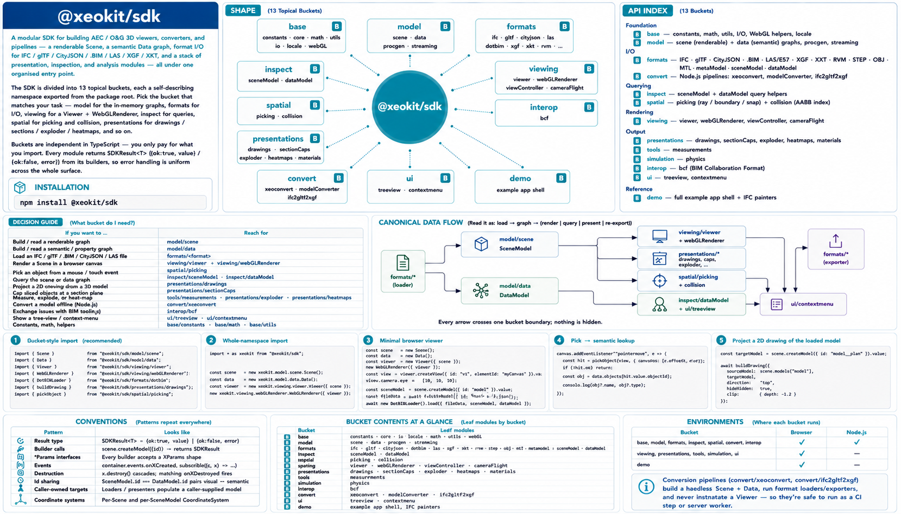
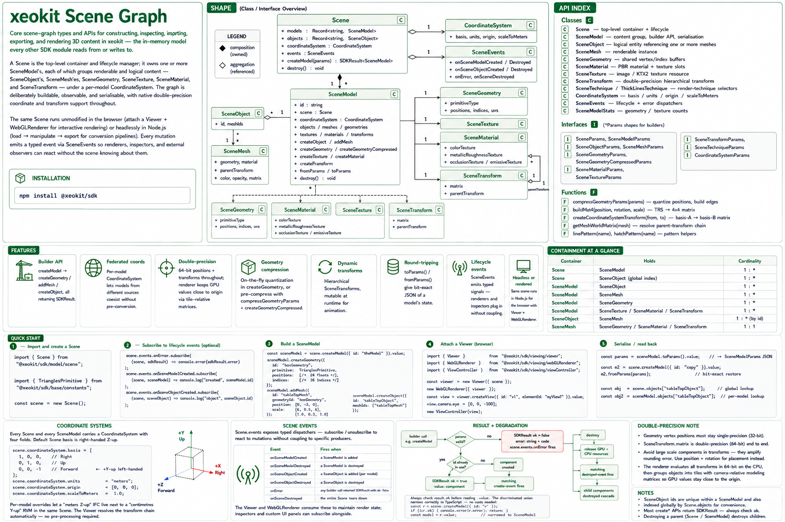
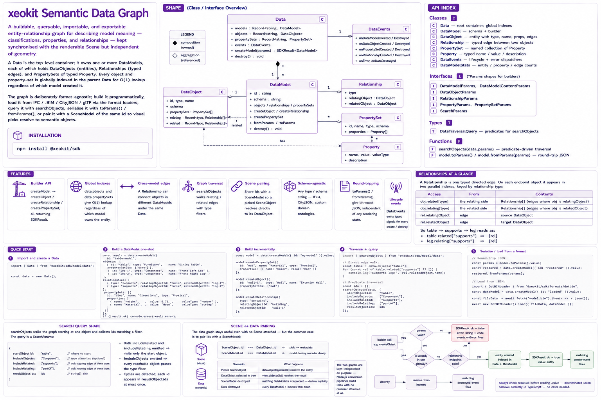
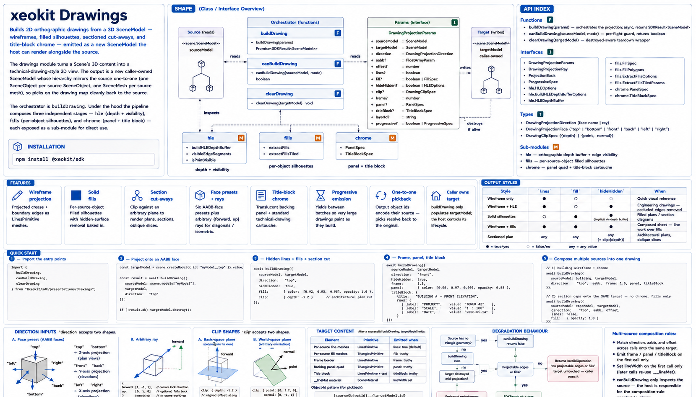

# @xeokit SDK (V3)

> **High‑performance AECO visualization for the web and Node.js**

Welcome to **xeokit**, a flexible, production‑grade SDK for creating fast, interactive visualizations of AECO (Architecture, Engineering, Construction & Operations) models directly in the browser or in Node.js.

Built with **TypeScript**, xeokit is designed for **extreme performance**: it streams, loads, and renders very large models with minimal memory and CPU usage. The SDK cleanly separates **data**, **scene representation**, and **rendering**, making it suitable for everything from lightweight viewers to complex BIM pipelines.

---

## Key Features

* **Lightning‑fast rendering** of massive AECO models via batched draw calls, data textures, and a renderer designed for IFC-scale scenes.
* **Browser & Node.js support** for viewing, conversion, and preprocessing.
* **Scene graph + data graph** architecture, decoupled so semantics and geometry can be authored independently.
* **Multi‑canvas, multi‑view viewers** with floating-panel and tiled layouts.
* **Full precision (64‑bit) coordinate system**, so georeferenced and city-scale models render without jitter.
* **Pluggable renderer backends** (WebGL today, WebGPU ready).
* **Import, export & convert** industry‑standard AECO formats (IFC, glTF, LAS, CityJSON, XKT, XGF, DotBIM, OBJ, MTL, 3D Gaussian Splatting).
* **BIM collaboration** via BCF Viewpoints.
* **Procedural content** (materials, geometry, environments) for scaffolding and tests.
* **Open‑source** with a permissive AGPL‑3.0 license.

---

## Table of Contents

#### [Modules](#modules)
  - [Base](#base)
  - [Model](#model)
  - [Spatial](#spatial)
  - [Viewing](#viewing)
  - [Formats](#formats)
  - [Convert](#convert)
  - [Inspect](#inspect)
  - [Presentations](#presentations)
  - [Tools](#tools)
  - [Simulation](#simulation)
  - [Interop](#interop)
  - [UI](#ui)
  - [Demo](#demo)

#### [Cheatsheets](#cheatsheets)

#### [Examples](#examples)
  - [Spinning 3D Box](#spinning-3d-box)
  - [IFC Model Viewer](#ifc-model-viewer)
  - [IFC to DotBIM Conversion via CLI](#converting-an-ifc-file-to-dotbim-via-cli)

#### [Project Development](#project-development)
  - [Installation](#installation)
  - [Building the SDK](#build-sdk)
  - [Generating Docs](#build-typedocs)

#### [License](#license)
#### [Credits](#credits)

---


## Modules

The SDK is organised into **topical buckets** rather than a flat namespace. Every import path begins with one of the buckets below; the table inside each bucket lists the concrete submodules. The same buckets are exposed at runtime as namespaces on the root `xeokit` object (e.g. `xeokit.model.scene`, `xeokit.viewing.viewer`).

See the [Cheatsheets](#cheatsheets) section below for visual overviews.

### Base

Foundational primitives every other bucket depends on: result types, math, constants, locale strings, low-level WebGL utilities.

| Module                                                                                                                  | Description                                            |
|-------------------------------------------------------------------------------------------------------------------------|--------------------------------------------------------|
| [`@xeokit/sdk/base/core`](https://xeokit.github.io/sdk/docs/api/modules/base.core.html)                                 | `SDKResult`, `SDKErrorType`, `SDKTask`, event emitter. |
| [`@xeokit/sdk/base/constants`](https://xeokit.github.io/sdk/docs/api/modules/base.constants.html)                       | Shared enums (primitive types, render modes, …).       |
| [`@xeokit/sdk/base/math`](https://xeokit.github.io/sdk/docs/api/modules/base.math.html)                                 | Vectors, matrices, quaternions, AABBs.                 |
| [`@xeokit/sdk/base/utils`](https://xeokit.github.io/sdk/docs/api/modules/base.utils.html)                               | `createUUID`, small helpers.                           |
| [`@xeokit/sdk/base/io`](https://xeokit.github.io/sdk/docs/api/modules/base.io.html)                                     | File I/O wrappers for browser and Node.                |
| [`@xeokit/sdk/base/locale`](https://xeokit.github.io/sdk/docs/api/modules/base.locale.html)                             | Localisation service.                                  |
| [`@xeokit/sdk/base/webGL`](https://xeokit.github.io/sdk/docs/api/modules/base.webGL.html)                               | Low-level WebGL utilities (buffers, textures, FBOs).   |

---

### Model

The **scene graph** (3D geometry, materials, objects) and the **data graph** (semantic entities, relationships, property sets). Both are renderer-agnostic and run identically in the browser and Node. Streaming and procedural authoring live here too.

| Module                                                                                                  | Description                                              |
|---------------------------------------------------------------------------------------------------------|----------------------------------------------------------|
| [`@xeokit/sdk/model/scene`](https://xeokit.github.io/sdk/docs/api/modules/model.scene.html)             | Scene graph: `SceneModel`, `SceneObject`, `SceneMesh`, …  |
| [`@xeokit/sdk/model/data`](https://xeokit.github.io/sdk/docs/api/modules/model.data.html)               | Semantic graph: `DataModel`, `DataObject`, relationships. |
| [`@xeokit/sdk/model/procgen`](https://xeokit.github.io/sdk/docs/api/modules/model.procgen.html)         | Procedural geometry / materials / environment generators. |
| [`@xeokit/sdk/model/streaming`](https://xeokit.github.io/sdk/docs/api/modules/model.streaming.html)     | Chunked model streaming + caching.                       |

---

### Spatial

CPU-side spatial indices and the picking pipeline that builds on them.

| Module                                                                                                       | Description                                              |
|--------------------------------------------------------------------------------------------------------------|----------------------------------------------------------|
| [`@xeokit/sdk/spatial/collision`](https://xeokit.github.io/sdk/docs/api/modules/spatial.collision.html)      | KdTree / BVH indices over scene geometry.                |
| [`@xeokit/sdk/spatial/picking`](https://xeokit.github.io/sdk/docs/api/modules/spatial.picking.html)          | Ray / canvas-pos picking, snap-to-vertex / snap-to-edge. |

---

### Viewing

The browser viewer and its pluggable renderer backends, plus camera animations and pointer-driven controllers.

| Module                                                                                                                          | Description                                  |
|---------------------------------------------------------------------------------------------------------------------------------|----------------------------------------------|
| [`@xeokit/sdk/viewing/viewer`](https://xeokit.github.io/sdk/docs/api/modules/viewing.viewer.html)                               | `Viewer`, `View`, `Camera`, lights, effects. |
| [`@xeokit/sdk/viewing/webGLRenderer`](https://xeokit.github.io/sdk/docs/api/modules/viewing.webGLRenderer.html)                 | WebGL rendering backend.                     |
| [`@xeokit/sdk/viewing/viewController`](https://xeokit.github.io/sdk/docs/api/modules/viewing.viewController.html)               | Mouse / touch camera controllers.            |
| [`@xeokit/sdk/viewing/cameraFlight`](https://xeokit.github.io/sdk/docs/api/modules/viewing.cameraFlight.html)                   | Camera flight animations and bookmarks.      |

---

### Formats

Import / export modules for the AECO file formats xeokit supports. Each loader populates a `SceneModel` (and optionally a `DataModel`); each exporter consumes them.

| Module                                                                                                       | Description                       |
|--------------------------------------------------------------------------------------------------------------|-----------------------------------|
| [`@xeokit/sdk/formats/ifc`](https://xeokit.github.io/sdk/docs/api/modules/formats.ifc.html)                  | Import / export IFC.              |
| [`@xeokit/sdk/formats/gltf`](https://xeokit.github.io/sdk/docs/api/modules/formats.gltf.html)                | Import / export glTF / GLB.       |
| [`@xeokit/sdk/formats/xgf`](https://xeokit.github.io/sdk/docs/api/modules/formats.xgf.html)                  | Import / export XGF.              |
| [`@xeokit/sdk/formats/xkt`](https://xeokit.github.io/sdk/docs/api/modules/formats.xkt.html)                  | Import XKT.                       |
| [`@xeokit/sdk/formats/dotbim`](https://xeokit.github.io/sdk/docs/api/modules/formats.dotbim.html)            | Import / export DotBIM.           |
| [`@xeokit/sdk/formats/cityjson`](https://xeokit.github.io/sdk/docs/api/modules/formats.cityjson.html)        | Import / export CityJSON.         |
| [`@xeokit/sdk/formats/las`](https://xeokit.github.io/sdk/docs/api/modules/formats.las.html)                  | Import LAS / LAZ point clouds.    |
| [`@xeokit/sdk/formats/gaussiansplat`](https://xeokit.github.io/sdk/docs/api/modules/formats.gaussiansplat.html) | Import / export 3D Gaussian Splatting (`.splat`). |
| [`@xeokit/sdk/formats/fbx`](https://xeokit.github.io/sdk/docs/api/modules/formats.fbx.html)                  | Import / export FBX.              |
| [`@xeokit/sdk/formats/usdz`](https://xeokit.github.io/sdk/docs/api/modules/formats.usdz.html)                | Import / export USDZ.             |
| [`@xeokit/sdk/formats/obj`](https://xeokit.github.io/sdk/docs/api/modules/formats.obj.html)                  | Import / export OBJ.              |
| [`@xeokit/sdk/formats/mtl`](https://xeokit.github.io/sdk/docs/api/modules/formats.mtl.html)                  | Import / export MTL material definitions. |
| [`@xeokit/sdk/formats/pdf`](https://xeokit.github.io/sdk/docs/api/modules/formats.pdf.html)                  | Import PDF drawing sheets.        |
| [`@xeokit/sdk/formats/dwg`](https://xeokit.github.io/sdk/docs/api/modules/formats.dwg.html)                  | Import DWG drawings.              |
| [`@xeokit/sdk/formats/dxf`](https://xeokit.github.io/sdk/docs/api/modules/formats.dxf.html)                  | Import / export DXF drawings.     |
| [`@xeokit/sdk/formats/svg`](https://xeokit.github.io/sdk/docs/api/modules/formats.svg.html)                  | Import / export SVG drawings.     |
| [`@xeokit/sdk/formats/fds`](https://xeokit.github.io/sdk/docs/api/modules/formats.fds.html)                  | Import / export Fire Dynamics Simulator (FDS). |
| [`@xeokit/sdk/formats/threedxml`](https://xeokit.github.io/sdk/docs/api/modules/formats.threedxml.html)      | Import / export 3DXML (Dassault Systèmes). |
| [`@xeokit/sdk/formats/scenemodel`](https://xeokit.github.io/sdk/docs/api/modules/formats.scenemodel.html)    | Import / export native scene-model JSON. |
| [`@xeokit/sdk/formats/datamodel`](https://xeokit.github.io/sdk/docs/api/modules/formats.datamodel.html)      | Import / export native data-model JSON. |
| [`@xeokit/sdk/formats/metamodel`](https://xeokit.github.io/sdk/docs/api/modules/formats.metamodel.html)      | Import legacy metamodel JSON.     |

---

### Convert

Format-conversion pipelines and the `xeoconvert` CLI.

| Module                                                                                                              | Description                                  |
|---------------------------------------------------------------------------------------------------------------------|----------------------------------------------|
| [`@xeokit/sdk/convert/modelConverter`](https://xeokit.github.io/sdk/docs/api/modules/convert.modelConverter.html)   | Programmatic multi-format converter.         |
| [`@xeokit/sdk/convert/ifc2gltf2xgf`](https://xeokit.github.io/sdk/docs/api/modules/convert.ifc2gltf2xgf.html)       | IFC → glTF → XGF pipeline.                   |
| [`@xeokit/sdk/convert/xeoconvert`](https://xeokit.github.io/sdk/docs/api/modules/convert.xeoconvert.html)           | Command-line wrapper around the above.       |

---

### Inspect

Read-only inspectors that report on the integrity and statistics of scene and data models.

| Module                                                                                                  | Description                                              |
|---------------------------------------------------------------------------------------------------------|----------------------------------------------------------|
| [`@xeokit/sdk/inspect`](https://xeokit.github.io/sdk/docs/api/modules/inspect.html)                     | `SceneModelInspector`, `DataModelInspector`, and helpers. |

---

### Presentations

**Scene processors** — modules that consume a `SceneModel` and emit a new one or mutate its presentation state. Useful for engineering output: technical drawings, sliced caps, heat maps, exploded views, recolour palettes.

| Module                                                                                                                  | Description                                              |
|-------------------------------------------------------------------------------------------------------------------------|----------------------------------------------------------|
| [`@xeokit/sdk/presentations/drawings`](https://xeokit.github.io/sdk/docs/api/modules/presentations.drawings.html)       | Orthographic 2D drawings (wireframes, fills, chrome).    |
| [`@xeokit/sdk/presentations/sectionCaps`](https://xeokit.github.io/sdk/docs/api/modules/presentations.sectionCaps.html) | Solid-cap geometry where section planes slice solids.    |
| [`@xeokit/sdk/presentations/exploder`](https://xeokit.github.io/sdk/docs/api/modules/presentations.exploder.html)       | Per-object translation for assembly-explode views.       |
| [`@xeokit/sdk/presentations/heatmaps`](https://xeokit.github.io/sdk/docs/api/modules/presentations.heatmaps.html)       | Scalar-data colour overlays as material textures.        |
| [`@xeokit/sdk/presentations/materials`](https://xeokit.github.io/sdk/docs/api/modules/presentations.materials.html)     | Curated procedural-material palette (`MaterialsPalette`).|

---

### Tools

Interactive widgets backed by picking.

| Module                                                                                                          | Description                                            |
|-----------------------------------------------------------------------------------------------------------------|--------------------------------------------------------|
| [`@xeokit/sdk/tools/measurements`](https://xeokit.github.io/sdk/docs/api/modules/tools.measurements.html)       | Distance + angle measurement tools.                    |

---

### Simulation

Animation / physics runtimes that drive scene transforms over time.

| Module                                                                                                          | Description                                                  |
|-----------------------------------------------------------------------------------------------------------------|--------------------------------------------------------------|
| [`@xeokit/sdk/simulation/physics`](https://xeokit.github.io/sdk/docs/api/modules/simulation.physics.html)       | Rigid-body physics integration (`getScenePhysics`).          |

---

### Interop

Cross-tool interchange formats that aren't strictly model formats.

| Module                                                                                                  | Description                                              |
|---------------------------------------------------------------------------------------------------------|----------------------------------------------------------|
| [`@xeokit/sdk/interop/bcf`](https://xeokit.github.io/sdk/docs/api/modules/interop.bcf.html)             | Load and save BCF Viewpoints.                            |

---

### UI

Plain-DOM UI primitives the demo and host applications can compose.

| Module                                                                                  | Description                                              |
|-----------------------------------------------------------------------------------------|----------------------------------------------------------|
| [`@xeokit/sdk/ui`](https://xeokit.github.io/sdk/docs/api/modules/ui.html)               | Context menus, floating panels, button bars, dialogs.    |

---

### Demo

Higher-level glue used by the demo site and the example gallery — `DemoHelper`, the toolbar, the panel registry, IFC-material auto-application, etc. Most production hosts won't depend on this bucket directly.

| Module                                                                                          | Description                                              |
|-------------------------------------------------------------------------------------------------|----------------------------------------------------------|
| [`@xeokit/sdk/demo`](https://xeokit.github.io/sdk/docs/api/modules/demo.html)                   | `DemoHelper`, demo panels, sample-model registry.        |

---

## Cheatsheets

Visual one-page references for the SDK and its main buckets. Click a thumbnail to open the full-size image, or use the Download link to save a local copy.

<table>
<tr>
<td align="center" width="50%">
<a href="packages/website/images/cheatsheets/sdk_overview.png"></a><br/>
<strong>SDK at a glance</strong><br/>
<a href="packages/website/images/cheatsheets/sdk_overview.png">Open</a> · <a href="packages/website/images/cheatsheets/sdk_overview.png" download>Download</a>
</td>
<td align="center" width="50%">
<a href="packages/website/images/cheatsheets/model_scene.png"></a><br/>
<strong><code>model/scene</code> at a glance</strong><br/>
<a href="packages/website/images/cheatsheets/model_scene.png">Open</a> · <a href="packages/website/images/cheatsheets/model_scene.png" download>Download</a>
</td>
</tr>
<tr>
<td align="center" width="50%">
<a href="packages/website/images/cheatsheets/model_data.png"></a><br/>
<strong><code>model/data</code> at a glance</strong><br/>
<a href="packages/website/images/cheatsheets/model_data.png">Open</a> · <a href="packages/website/images/cheatsheets/model_data.png" download>Download</a>
</td>
<td align="center" width="50%">
<a href="packages/website/images/cheatsheets/presentations_drawings.png"></a><br/>
<strong><code>presentations/drawings</code> at a glance</strong><br/>
<a href="packages/website/images/cheatsheets/presentations_drawings.png">Open</a> · <a href="packages/website/images/cheatsheets/presentations_drawings.png" download>Download</a>
</td>
</tr>
</table>

---

## Examples

Some minimal examples to get you started. Find more examples
at [xeokit.github.io/sdk/examples](https://xeokit.github.io/sdk/examples/).

### Spinning 3D Box

In the example below, we create a simple 3D box model and set up a viewer to display it in a canvas
element with the ID `myCanvas`. The camera orbits around the box to create a spinning effect.

In xeokit, everything starts with a **Scene** that holds all 3D content. We then create
a **Viewer** to visualize the scene, and a **WebGLRenderer** to handle rendering.

Instead of using exceptions, errors are handled gracefully using result monads. Any method in the SDK that can
fail returns an `SDKResult` that indicates success or failure.

Scene content is fully dynamic and can be modified at runtime. We can create and destroy
geometries, meshes, and objects in the Scene and the Viewer will update automatically.

Everything is coupled via events. The Scene emits events when content changes; the Viewer
emits events when viewing parameters change, and the WebGLRenderer reacts to all these events
to update the display accordingly.

```bash
npm install @xeokit/sdk
```

```javascript
import { Scene } from "@xeokit/sdk/model/scene";
import { Viewer } from "@xeokit/sdk/viewing/viewer";
import { WebGLRenderer } from "@xeokit/sdk/viewing/webGLRenderer";
import { SDKTask } from "@xeokit/sdk/base/core";
import { TrianglesPrimitive } from "@xeokit/sdk/base/constants";

const scene = new Scene();
const viewer = new Viewer({ scene });
const renderer = new WebGLRenderer({ viewer });

const viewResult = viewer.createView({
  id: "view",
  elementId: "myCanvas"
});

if (!viewResult.ok) {
  throw new Error(viewResult.error);
}

const view = viewResult.value;

view.camera.eye = [0, 0, 10];
view.camera.look = [0, 0, 0];
view.camera.up = [0, 1, 0];

const modelResult = scene.createModel({ id: "boxModel" });

if (!modelResult.ok) {
  throw new Error(modelResult.error);
}

const model = modelResult.value;

model.createGeometry({
  id: "boxGeometry",
  primitive: TrianglesPrimitive,
  positions: [-1, -1, -1, 1, -1, -1, 1, 1, -1, -1, 1, -1],
  indices: [0, 1, 2, 0, 2, 3]
});

model.createMesh({
  id: "boxMesh",
  geometryId: "boxGeometry",
  color: [1, 0, 0]
});

model.createObject({
  id: "box",
  meshIds: ["boxMesh"]
});

new SDKTask({
  repeat: true,
  task: () => view.camera.orbitYaw(1)
});
```

---

### IFC Model Viewer

Load and display an IFC model in the browser, including semantic structure via the data graph.

```javascript
import { Scene } from "@xeokit/sdk/model/scene";
import { Data, searchObjects } from "@xeokit/sdk/model/data";
import { Viewer } from "@xeokit/sdk/viewing/viewer";
import { WebGLRenderer } from "@xeokit/sdk/viewing/webGLRenderer";
import { ViewController } from "@xeokit/sdk/viewing/viewController";
import { IFCLoader } from "@xeokit/sdk/formats/ifc";

// Create containers for geometry and optional structural data

const scene = new Scene();
const data = new Data();

// Create a Viewer and WebGL renderer

const viewer = new Viewer({ scene });
new WebGLRenderer({ viewer });

// Create a View bound to an existing canvas element

const view = viewer.createView({
    id: "myView",
    elementId: "myCanvas" // Ensure this element exists
}).value;

// Position the camera

view.camera.eye = [-6.01, 4.85, 9.11];
view.camera.look = [3.93, -2.65, -12.51];
view.camera.up = [0.12, 0.95, -0.27];

// Enable mouse / touch camera interaction

new ViewController(view, {});

// Create target models for the loader

const sceneModel = scene.createModel({ id: "myModel" }).value;
const dataModel = data.createModel({ id: "myModel" }).value;

// Create the IFC loader

const ifcLoader = new IFCLoader();

// Fetch and decode the IFC file

fetch("model.ifc")
    .then((r) => r.arrayBuffer())
    .then((fileData) => {

        // Load geometry (and optional node hierarchy) into the models

        return ifcLoader.load({
            fileData,
            sceneModel,
            dataModel
        });
    })
    .then(() => {

        // Model successfully loaded and visible.

        // Search the data graph for IfcWall objects, starting at the
        // IfcProject root node, including any children via IfcRelAggregates relationships.

      const resultObjectIds = [];

      const result = searchObjects(data, {
        startObjectId: "38aOKO8_DDkBd1FHm_lVXz", // Root IfcProject ID
        includeObjects: ["IfcWall"],
        includeRelated: ["IfcRelAggregates"],
        resultObjectIds
      });

      // Check if the query succeeded.

      if (!result.ok) {
        console.error("Error querying IFC data: " + result.error);
        return;
      }

      // If the query succeeded, go ahead and mark whatever
      // objects we found as selected. Now all the IfcWall objects
      // in the Viewer will appear selected and glowing.

      view.setObjectsSelected(resultObjectIds, true);
    })
    .catch((err) => {
        // Clean up on failure
        sceneModel.destroy();
        dataModel.destroy();
        console.error("Error loading IFC:", err);
    });
```

---

### Converting an IFC file to DotBIM via CLI

Convert an IFC file to DotBIM format using the `xeoconvert` command-line tool.

```bash
node ./node_modules/@xeokit/sdk/dist/xeoconvert.js \
  --pipeline ifc2dotbim \
  --ifc model.ifc \
  --dotbim model.bim \
  --log \
  --stats conversion_stats.json
```

---

## Project Development

### Installation

Install pnpm (recommended globally):

```bash
npm install -g pnpm
```

Clone the repository:

```bash
git clone https://github.com/xeokit/sdk
cd sdk
```

Install dependencies:

```bash
pnpm install
```

---

### Build SDK

Build the xeokit SDK:

```bash
pnpm sdk-dist
```

Output:

```
./packages/sdk/dist
```

This directory contains the compiled JavaScript bundles and dependencies.

---

### Build TypeDocs

Generate API documentation:

```bash
pnpm website-sdk-docs
```

Output:

```
./packages/website/docs
```

The `website` package is configured as the root for GitHub Pages hosting.

---

## License

Copyright © 2026

Licensed under the **AGPL‑3.0**.

---

## Credits

See [Credits](/credits.html).
