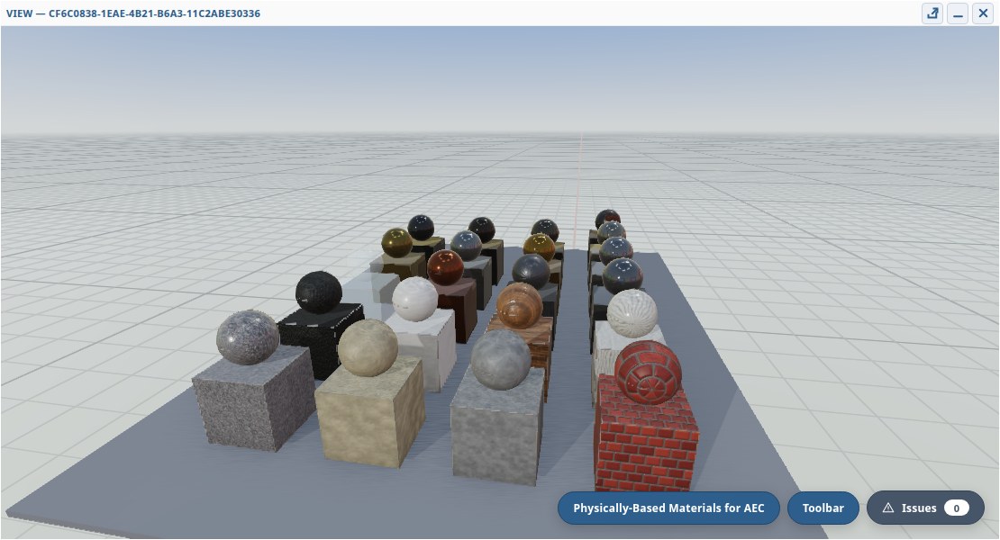

# Author SceneModel Materials and Textures

This tutorial shows how to author appearance for a `SceneModel`. Geometry
describes shape, meshes place that shape, objects provide interaction
boundaries, and materials describe how surfaces should look. Keeping those
responsibilities separate lets many meshes share the same material while
remaining independently pickable, selectable and visible.

The main concepts are:

- `SceneMaterial` is reusable appearance state. It can be referenced by many
  meshes with `materialId`.
- `SceneTexture` stores an image, pixel buffer, decoded image source or
  compressed texture payload. Materials refer to textures by ID.
- `SceneMesh` can either reference a material or carry simple mesh-local
  appearance such as `color` and `opacity`.
- PBR material fields such as `color`, `opacity`, `metallic`, `roughness`,
  `emissiveColor`, `clearcoat` and `sheen` describe lighting response.
- Texture slots add image detail: color, metallic-roughness, normal, occlusion
  and emissive.

Use reusable materials for repeated building parts, source materials imported
from files, and any appearance you want to keep consistent across many meshes.
Use mesh-local `color` and `opacity` for quick generated overlays, simple debug
geometry and one-off objects.

[](https://xeokit.github.io/sdk/examples/index.html#studio/create/materials/aec-chart)

The live
[Physically-Based Materials for AEC](https://xeokit.github.io/sdk/examples/index.html#studio/create/materials/aec-chart)
example shows authored AEC materials under shared lighting.

---

## 1. Create the Viewer and Model

Start with a normal scene, viewer, view and renderer:

```javascript
import {
  LinearEncoding,
  RepeatWrapping,
  sRGBEncoding,
  TrianglesPrimitive
} from "@xeokit/sdk/base/constants";
import {paintBrick, paintGlass, paintPolSteel} from "@xeokit/sdk/model/generation/paintMaterials";
import {Scene} from "@xeokit/sdk/model/scene";
import {Viewer} from "@xeokit/sdk/viewing/viewer";
import {WebGLRenderer} from "@xeokit/sdk/viewing/renderers/webGL";
import {ModelNavigationController} from "@xeokit/sdk/viewing/navigation/model";

const scene = new Scene();
const viewer = new Viewer({scene});

const viewResult = viewer.createView({
  id: "main",
  htmlElement: document.getElementById("viewerCanvas"),
  backgroundColor: [0.94, 0.96, 0.98],
  camera: {
    eye: [8, -10, 6],
    look: [0, 0, 1.2],
    up: [0, 0, 1]
  }
});

if (!viewResult.ok) {
  throw new Error(viewResult.error);
}

const view = viewResult.value;
const renderer = new WebGLRenderer({viewer});
new ModelNavigationController(view);

const modelResult = scene.createModel({
  id: "materials-demo",
  coordinateSystem: {
    basis: [
      1, 0, 0,
      0, 1, 0,
      0, 0, 1
    ],
    origin: [0, 0, 0],
    units: "meters"
  }
});

if (!modelResult.ok) {
  throw new Error(modelResult.error);
}

const model = modelResult.value;
```

The renderer observes the `SceneModel` and uploads compatible materials and
textures into renderer-side storage. The authoring API stays the same for WebGL
and WebGPU.

---

## 2. Create Geometry

Create a unit box that the example can reuse for walls, windows and trim:

```javascript
const geometryResult = model.createGeometry({
  id: "unitBox",
  primitive: TrianglesPrimitive,
  positions: [
    -0.5, -0.5, -0.5,
     0.5, -0.5, -0.5,
     0.5,  0.5, -0.5,
    -0.5,  0.5, -0.5,
    -0.5, -0.5,  0.5,
     0.5, -0.5,  0.5,
     0.5,  0.5,  0.5,
    -0.5,  0.5,  0.5
  ],
  indices: [
    0, 1, 2, 0, 2, 3,
    4, 6, 5, 4, 7, 6,
    0, 4, 5, 0, 5, 1,
    1, 5, 6, 1, 6, 2,
    2, 6, 7, 2, 7, 3,
    3, 7, 4, 3, 4, 0
  ]
});

if (!geometryResult.ok) {
  throw new Error(geometryResult.error);
}
```

---

## 3. Create Simple Reusable Materials

Start with scalar PBR materials. These have no textures, but they can still be
shared by many meshes.

```javascript
const materialParams = [
  {
    id: "painted-plaster",
    color: [0.82, 0.82, 0.78],
    roughness: 0.78,
    metallic: 0.0
  },
  {
    id: "dark-metal",
    color: [0.24, 0.25, 0.26],
    roughness: 0.38,
    metallic: 0.65
  },
  {
    id: "warning-emissive",
    color: [1.0, 0.58, 0.12],
    emissiveColor: [0.75, 0.28, 0.04],
    roughness: 0.5
  }
];

for (const params of materialParams) {
  const result = model.createMaterial(params);

  if (!result.ok) {
    throw new Error(result.error);
  }
}
```

`color` is the base surface color. `roughness` controls how broad highlights
are. `metallic` controls whether the material behaves like a dielectric surface
or a metal. `emissiveColor` adds self-lit color, useful for signals, screens and
analysis markers.

---

## 4. Reference Materials from Meshes

Use `materialId` when a mesh should use a reusable material:

```javascript
function createBoxObject(params) {
  const meshId = `${params.id}-mesh`;

  const meshResult = model.createMesh({
    id: meshId,
    geometryId: "unitBox",
    materialId: params.materialId,
    color: params.color,
    opacity: params.opacity,
    position: params.position,
    scale: params.scale
  });

  if (!meshResult.ok) {
    throw new Error(meshResult.error);
  }

  const objectResult = model.createObject({
    id: params.id,
    meshIds: [meshId],
    layerId: params.layerId
  });

  if (!objectResult.ok) {
    throw new Error(objectResult.error);
  }
}

createBoxObject({
  id: "wall-01",
  layerId: "structure",
  materialId: "painted-plaster",
  position: [0, 0, 1.2],
  scale: [4.6, 0.24, 2.4]
});

createBoxObject({
  id: "beam-01",
  layerId: "structure",
  materialId: "dark-metal",
  position: [0, 0, 2.55],
  scale: [4.9, 0.32, 0.24]
});
```

The helper also accepts mesh-local `color` and `opacity`. Use those only when
you intentionally want simple one-off appearance without creating a named
material.

```javascript
createBoxObject({
  id: "debug-volume",
  layerId: "analysis",
  color: [0.1, 0.55, 1.0],
  opacity: 0.35,
  position: [0, 0.8, 1.0],
  scale: [2.0, 0.1, 1.6]
});
```

Material reuse gives renderers more consistent input to classify and pack
internally. You do not need to expose renderer-specific material knobs in
authoring code.

---

## 5. Create Textures from Generated Material Maps

The `model/generation/paintMaterials` module can generate tileable PBR texture
sets at runtime. Each painter returns:

- `color`: albedo/base-color pixels.
- `normal`: tangent-space normal-map pixels.
- `mr`: metallic-roughness pixels, following glTF-style metallic-roughness map
  semantics.
- `flatColor` and `flatOpacity`: optional fallback values for textureless
  contexts.

Create `SceneTexture`s before creating the material that references them:

```javascript
function createPBRTextures(id, maps) {
  const textureParams = [
    {
      id: `${id}-color`,
      imageData: maps.color,
      encoding: sRGBEncoding,
      wrapS: RepeatWrapping,
      wrapT: RepeatWrapping,
      mipmap: true
    },
    {
      id: `${id}-normal`,
      imageData: maps.normal,
      encoding: LinearEncoding,
      wrapS: RepeatWrapping,
      wrapT: RepeatWrapping,
      mipmap: true
    },
    {
      id: `${id}-mr`,
      imageData: maps.mr,
      encoding: LinearEncoding,
      wrapS: RepeatWrapping,
      wrapT: RepeatWrapping,
      mipmap: true
    }
  ];

  for (const params of textureParams) {
    const result = model.createTexture(params);

    if (!result.ok) {
      throw new Error(result.error);
    }
  }
}

const brickMaps = paintBrick(256);
createPBRTextures("brick", brickMaps);

const brickMaterialResult = model.createMaterial({
  id: "brick",
  color: brickMaps.flatColor,
  roughness: 0.85,
  metallic: 0.0,
  colorTextureId: "brick-color",
  normalsTextureId: "brick-normal",
  metallicRoughnessTextureId: "brick-mr",
  triplanarScale: 0.7
});

if (!brickMaterialResult.ok) {
  throw new Error(brickMaterialResult.error);
}
```

Use `sRGBEncoding` for color textures. Use `LinearEncoding` for normal,
metallic-roughness, occlusion and emissive data unless your source format says
otherwise. `mipmap: true` is useful for textured surfaces that will be seen at
varying distances because it reduces shimmer at grazing angles and far zooms.

`triplanarScale` gives renderers a physical repeat scale for meshes that use the
material but have no UV coordinates. That is common for generated boxes, BIM
sweeps and other procedural geometry.

---

## 6. Author Transparent Glass

For transparent materials, use `alphaMode: "BLEND"` with an opacity below one.
The opacity is multiplied by the color texture alpha when a color texture is
bound.

```javascript
const glassMaps = paintGlass(128);
createPBRTextures("glass", glassMaps);

const glassMaterialResult = model.createMaterial({
  id: "glass",
  color: glassMaps.flatColor,
  opacity: glassMaps.flatOpacity,
  roughness: 0.04,
  metallic: 0.0,
  alphaMode: "BLEND",
  colorTextureId: "glass-color",
  normalsTextureId: "glass-normal",
  metallicRoughnessTextureId: "glass-mr"
});

if (!glassMaterialResult.ok) {
  throw new Error(glassMaterialResult.error);
}

for (let bay = 0; bay < 4; bay++) {
  createBoxObject({
    id: `window-${bay}`,
    layerId: "facade",
    materialId: "glass",
    position: [-1.8 + bay * 1.2, -0.14, 1.25],
    scale: [0.62, 0.08, 0.48]
  });
}
```

Use `alphaMode: "MASK"` for cutout materials such as fences, grilles and
foliage, where fragments are either kept or discarded. Use `"BLEND"` for glass
and translucent analysis surfaces.

---

## 7. Add a Metal with Generated Maps

Generated maps are useful for metals too:

```javascript
const steelMaps = paintPolSteel(128);
createPBRTextures("polished-steel", steelMaps);

const steelMaterialResult = model.createMaterial({
  id: "polished-steel",
  color: steelMaps.flatColor,
  roughness: 0.22,
  metallic: 1.0,
  colorTextureId: "polished-steel-color",
  normalsTextureId: "polished-steel-normal",
  metallicRoughnessTextureId: "polished-steel-mr"
});

if (!steelMaterialResult.ok) {
  throw new Error(steelMaterialResult.error);
}

createBoxObject({
  id: "column-01",
  layerId: "structure",
  materialId: "polished-steel",
  position: [-2.1, 0.6, 1.2],
  scale: [0.22, 0.22, 2.4]
});
```

For authored materials, `metallic` and `roughness` should still reflect the
intended surface even when a metallic-roughness texture is bound. The scalar
values are also useful fallbacks for textureless exports, previews and tools.

---

## 8. Load Textures from External Images

When textures are already in files, create `SceneTexture`s with `src`:

```javascript
const colorTextureResult = model.createTexture({
  id: "tile-color",
  src: "./textures/tile-color.png",
  encoding: sRGBEncoding,
  wrapS: RepeatWrapping,
  wrapT: RepeatWrapping,
  mipmap: true
});

if (!colorTextureResult.ok) {
  throw new Error(colorTextureResult.error);
}

const normalTextureResult = model.createTexture({
  id: "tile-normal",
  src: "./textures/tile-normal.png",
  encoding: LinearEncoding,
  wrapS: RepeatWrapping,
  wrapT: RepeatWrapping,
  mipmap: true
});

if (!normalTextureResult.ok) {
  throw new Error(normalTextureResult.error);
}

const tileMaterialResult = model.createMaterial({
  id: "tile",
  color: [0.72, 0.74, 0.76],
  roughness: 0.55,
  metallic: 0.0,
  colorTextureId: "tile-color",
  normalsTextureId: "tile-normal",
  triplanarScale: 0.5
});

if (!tileMaterialResult.ok) {
  throw new Error(tileMaterialResult.error);
}
```

`SceneTexture` can also accept `imageData`, an already decoded `image`, or
transcoded `buffers`. Use `src` for ordinary web image files, `imageData` for
generated pixels, `image` when your application already owns an image or canvas,
and `buffers` for compressed/transcoded texture payloads.

---

## 9. Rules of Thumb

Create reusable `SceneMaterial`s for source materials and repeated parts. Many
meshes can share one material while still belonging to different `SceneObject`s.

Use mesh-local `color` and `opacity` for one-off overlays and debug geometry.
Use `materialId` for stable authored appearance.

Create textures before the materials that reference them. `SceneModel` validates
texture IDs when you call `createMaterial()`.

Use `sRGBEncoding` for albedo/color textures and `LinearEncoding` for data maps
such as normals, metallic-roughness and occlusion.

Use `alphaMode: "BLEND"` for translucent materials and `alphaMode: "MASK"` for
cutouts. Do not force view opacity to `1` to clear transparency; clear a view
opacity override with `null` when returning an object to its authored material.

Use generated material maps for examples, procedural scenes and tests that need
realistic PBR input without shipping image files.

Prefer authoring choices that describe content. Let renderers classify and pack
compatible materials internally.
