# xeokit SDK Performance Evaluation Guide

Use this guide to evaluate xeokit SDK rendering, loading, streaming and view-effect
performance across WebGL and WebGPU.

Serve the website examples first:

```bash
./node_modules/.bin/http-server packages/website -p 8097 --bind 127.0.0.1
```

Then open examples at:

```text
http://127.0.0.1:8097/examples/<example-id>/
```

For WebGPU, use a WebGPU-capable browser and adapter. When comparing renderers,
use the same machine, browser build, display scale, window size, camera path and
effect settings.

Select the renderer backend with `?renderer=webgl` or `?renderer=webgpu`.
Studio-backed examples default to WebGPU when the browser supports it, so use
`?renderer=webgl` when you need an explicit WebGL run.

## Start With Large Models

Most xeokit evaluations start with one question: how does the SDK behave with
large models, many objects and real application data? Use these examples first
to measure load latency, object count, chunk scheduling, memory pressure,
camera stalls and settled frame rate.

| Example | Renderer Coverage | Use It For |
| --- | --- | --- |
| [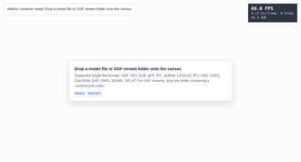](https://xeokit.github.io/sdk/examples/sdk/getting-started/model-file-drop/barebones/?renderer=webgl)<br>[Drop Your Own Model - WebGL](https://xeokit.github.io/sdk/examples/sdk/getting-started/model-file-drop/barebones/?renderer=webgl)<br>[Drop Your Own Model - WebGPU](https://xeokit.github.io/sdk/examples/sdk/getting-started/model-file-drop/barebones/?renderer=webgpu) | WebGL or WebGPU, selected by URL | First-pass evaluation with the evaluator's own XGF, XKT, glTF, IFC, dotBIM, LAS/LAZ, PLY, FBX, USDZ, CityJSON, DXF, DWG, 3DXML, SPLAT or XGF stream data. |
| [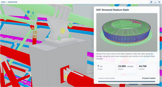](https://xeokit.github.io/sdk/examples/studio/streaming/xgf/baku-200-static/?renderer=webgl)<br>**Baku Stadium, 200 Chunks, Static**<br>[WebGL](https://xeokit.github.io/sdk/examples/studio/streaming/xgf/baku-200-static/?renderer=webgl) · [WebGPU](https://xeokit.github.io/sdk/examples/studio/streaming/xgf/baku-200-static/?renderer=webgpu) | WebGL or WebGPU, selected by URL | Primary Baku baseline. Start here for a smaller static stream before moving to larger dynamic chunk counts. |
| [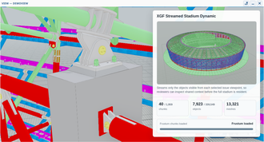](https://xeokit.github.io/sdk/examples/studio/benchmarks/streaming/xgf-baku-2000-dynamic/?renderer=webgl)<br>Baku Stadium, 2K Chunks, Dynamic<br>[WebGL](https://xeokit.github.io/sdk/examples/studio/benchmarks/streaming/xgf-baku-2000-dynamic/?renderer=webgl) · [WebGPU](https://xeokit.github.io/sdk/examples/studio/benchmarks/streaming/xgf-baku-2000-dynamic/?renderer=webgpu) | WebGL or WebGPU, selected by URL | Medium dynamic chunk-count test for streaming latency, cache pressure, first-frustum load and camera-stall behavior. |
| [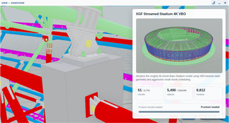](https://xeokit.github.io/sdk/examples/studio/benchmarks/streaming/xgf-baku-4000-dynamic/?renderer=webgl)<br>Baku Stadium, 4K Chunks, Dynamic<br>[WebGL](https://xeokit.github.io/sdk/examples/studio/benchmarks/streaming/xgf-baku-4000-dynamic/?renderer=webgl) · [WebGPU](https://xeokit.github.io/sdk/examples/studio/benchmarks/streaming/xgf-baku-4000-dynamic/?renderer=webgpu) | WebGL or WebGPU, selected by URL | Higher dynamic chunk-count test for request fan-out, scheduling overhead and memory pressure. |
| [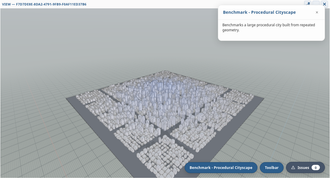](https://xeokit.github.io/sdk/examples/studio/benchmarks/scene/procedural-cityscape/?renderer=webgl)<br>[Procedural Cityscape](https://xeokit.github.io/sdk/examples/studio/benchmarks/scene/procedural-cityscape/?renderer=webgl) | WebGL | Repeated geometry, high object count and city-scale navigation. |
| [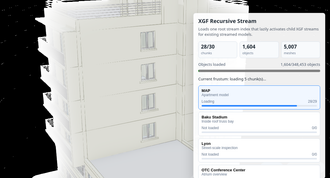](https://xeokit.github.io/sdk/examples/studio/streaming/xgf/recursive/?renderer=webgl)<br>[Recursive Streaming - Nested Model Set](https://xeokit.github.io/sdk/examples/studio/streaming/xgf/recursive/?renderer=webgl) | WebGL | Multi-model stream scheduling with independent child stream bounds. |
| [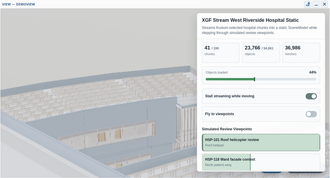](https://xeokit.github.io/sdk/examples/studio/streaming/xgf/west-river-side-hospital-static/?renderer=webgl)<br>[West Riverside Hospital Static](https://xeokit.github.io/sdk/examples/studio/streaming/xgf/west-river-side-hospital-static/?renderer=webgl) | WebGL static VBO | Building-scale stream scheduling, review viewpoints and static model navigation. |

## Object Mutation And State

Use these when the workload creates, destroys or changes many objects after the
viewer is already running.

| Example | Renderer Coverage | Use It For |
| --- | --- | --- |
| [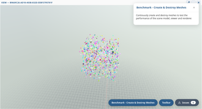](https://xeokit.github.io/sdk/examples/studio/benchmarks/scene/stress-test/?renderer=webgl)<br>[Create & Destroy Meshes](https://xeokit.github.io/sdk/examples/studio/benchmarks/scene/stress-test/?renderer=webgl) | WebGL | SceneModel, Viewer and renderer churn under continuous mesh creation/deletion. |
| [WebGPU - Creating a 3D Model Benchmark](https://xeokit.github.io/sdk/examples/sdk/benchmarks/scene/stress-test-webgpu/?renderer=webgpu) | WebGPU | WebGPU dynamic geometry, mesh and object creation/deletion. |
| [WebGPU Object States](https://xeokit.github.io/sdk/examples/sdk/view/webgpu/object-states/?renderer=webgpu) | WebGPU | Per-object style-bin, colorize, opacity and visibility updates. |

## Renderer Comparison

These pages compare WebGL and WebGPU visually because they run both renderers
side by side against the same scene or diagnostic setup. They are not selected
with `?renderer=...`; the page itself displays both backends.

| Example | Renderer Coverage | Use It For |
| --- | --- | --- |
| [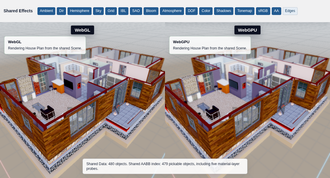](https://xeokit.github.io/sdk/examples/sdk/view/renderers/webgl-webgpu-shared-scene/)<br>[WebGL + WebGPU - Shared Scene](https://xeokit.github.io/sdk/examples/sdk/view/renderers/webgl-webgpu-shared-scene/) | Both, side by side | Baseline WebGL/WebGPU parity on the same `Scene` and `Data` graph. |
| [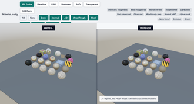](https://xeokit.github.io/sdk/examples/sdk/view/renderers/webgl-webgpu-material-parity/)<br>[Material Feature Parity](https://xeokit.github.io/sdk/examples/sdk/view/renderers/webgl-webgpu-material-parity/) | Both, side by side | Material and lighting cost: IBL, metal, rough dielectric, clearcoat, alpha, emissive and sheen paths. |
| [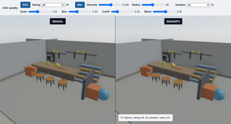](https://xeokit.github.io/sdk/examples/sdk/view/renderers/webgl-webgpu-sao-quality/)<br>[SAO Quality](https://xeokit.github.io/sdk/examples/sdk/view/renderers/webgl-webgpu-sao-quality/) | Both, side by side | SAO cost and quality, including depth, normals, raw occlusion, blur and final factor views. |
| [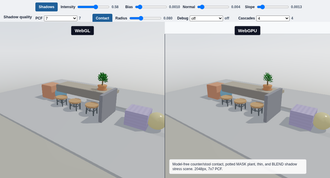](https://xeokit.github.io/sdk/examples/sdk/view/renderers/webgl-webgpu-shadow-quality/)<br>[Shadow Quality](https://xeokit.github.io/sdk/examples/sdk/view/renderers/webgl-webgpu-shadow-quality/) | Both, side by side | Shadow quality and cost for opaque, thin, alpha-masked and transparent casters. |
| [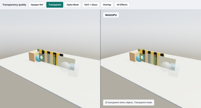](https://xeokit.github.io/sdk/examples/sdk/view/renderers/webgl-webgpu-transparency-quality/)<br>[Transparency Quality](https://xeokit.github.io/sdk/examples/sdk/view/renderers/webgl-webgpu-transparency-quality/) | Both, side by side | Sorting, overdraw and visual quality for alpha-mask foliage, glass and overlapping transparent layers. |
| [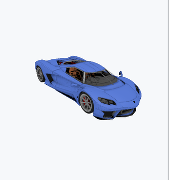](https://xeokit.github.io/sdk/examples/sdk/view/renderers/webgl-webgpu-style-bins/)<br>[Style Bins](https://xeokit.github.io/sdk/examples/sdk/view/renderers/webgl-webgpu-style-bins/) | Both, side by side | Runtime object state changes with user-defined style bins on WebGL and WebGPU. |

## Renderer-Specific Checks

Use these after the large-model and side-by-side pages when the evaluator needs
to isolate a renderer-specific path.

| Example | Renderer Coverage | Use It For |
| --- | --- | --- |
| [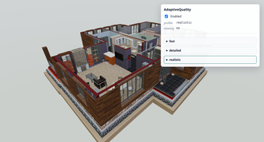](https://xeokit.github.io/sdk/examples/sdk/view/profiles/adaptive-quality/?renderer=webgl)<br>[AdaptiveQuality - ViewProfiles](https://xeokit.github.io/sdk/examples/sdk/view/profiles/adaptive-quality/?renderer=webgl) | WebGL | Profile switching cost while navigating versus at rest. |
| [Render Path Matrix Controls](https://xeokit.github.io/sdk/examples/sdk/view/webgpu/render-path-matrix/?renderer=webgpu) | WebGPU | Switch geometry, material, effect and renderer-backend combinations interactively. |
| [Render Path Tests](https://xeokit.github.io/sdk/examples/sdk/view/webgpu/render-path-matrix-gallery/?renderer=webgpu) | WebGPU | Compare captured WebGPU and WebGL render-path permutations. |
| [WebGPU RTC Tiles](https://xeokit.github.io/sdk/examples/sdk/view/webgpu/rtc-tiles/?renderer=webgpu) | WebGPU | Large-coordinate RTC tile assignment and per-mesh updates without geometry rebuild. |
| [WebGPU Table Shadows](https://xeokit.github.io/sdk/examples/sdk/view/webgpu/table-shadows/?renderer=webgpu) | WebGPU | Simple generated shadow scene for a quick WebGPU sanity check. |

## What To Measure

- **Startup:** time to first canvas, time to first model content, time to stable
  frame rate after load.
- **Scale:** object count, mesh count, triangle count, chunk count, draw calls
  and whether the model is static VBO, dynamic/DTX or WebGPU dynamic.
- **Navigation:** FPS and frame-time spikes while orbiting, panning, zooming and
  walking through dense areas.
- **Streaming:** time to first visible chunks, request fan-out, memory growth,
  stalls while moving the camera, settled memory after navigation stops.
- **Renderer effects:** cost of SAO, shadows, transparency, style bins, edges,
  material features and adaptive quality.
- **Mutation:** cost of creating, deleting and changing object state at runtime.
- **Memory:** JS heap, GPU memory where available, loaded chunk count, draw-count
  stability and whether resources are released after unloading or destroying.

## Suggested Evaluation Order

1. Start with [Drop Your Own Model - WebGL](https://xeokit.github.io/sdk/examples/sdk/getting-started/model-file-drop/barebones/?renderer=webgl) and [Drop Your Own Model - WebGPU](https://xeokit.github.io/sdk/examples/sdk/getting-started/model-file-drop/barebones/?renderer=webgpu) using the evaluator's own largest representative file.
2. Run the prominent [Baku 200 Static WebGL](https://xeokit.github.io/sdk/examples/studio/streaming/xgf/baku-200-static/?renderer=webgl) and [Baku 200 Static WebGPU](https://xeokit.github.io/sdk/examples/studio/streaming/xgf/baku-200-static/?renderer=webgpu) links to compare renderer backends on the same smaller static stream dataset.
3. Scale up to [Baku 2K Dynamic WebGL](https://xeokit.github.io/sdk/examples/studio/benchmarks/streaming/xgf-baku-2000-dynamic/?renderer=webgl), [Baku 2K Dynamic WebGPU](https://xeokit.github.io/sdk/examples/studio/benchmarks/streaming/xgf-baku-2000-dynamic/?renderer=webgpu), [Baku 4K Dynamic WebGL](https://xeokit.github.io/sdk/examples/studio/benchmarks/streaming/xgf-baku-4000-dynamic/?renderer=webgl) and [Baku 4K Dynamic WebGPU](https://xeokit.github.io/sdk/examples/studio/benchmarks/streaming/xgf-baku-4000-dynamic/?renderer=webgpu).
4. Use [Procedural Cityscape](https://xeokit.github.io/sdk/examples/studio/benchmarks/scene/procedural-cityscape/?renderer=webgl) for high object counts and repeated geometry.
5. Use [Shared Scene](https://xeokit.github.io/sdk/examples/sdk/view/renderers/webgl-webgpu-shared-scene/) and [Material Feature Parity](https://xeokit.github.io/sdk/examples/sdk/view/renderers/webgl-webgpu-material-parity/) to compare renderer parity after baseline scale tests.
6. Run [SAO Quality](https://xeokit.github.io/sdk/examples/sdk/view/renderers/webgl-webgpu-sao-quality/), [Shadow Quality](https://xeokit.github.io/sdk/examples/sdk/view/renderers/webgl-webgpu-shadow-quality/), [Transparency Quality](https://xeokit.github.io/sdk/examples/sdk/view/renderers/webgl-webgpu-transparency-quality/) and [Style Bins](https://xeokit.github.io/sdk/examples/sdk/view/renderers/webgl-webgpu-style-bins/) for effect-specific cost and visual correctness.
7. Use [Create & Destroy Meshes](https://xeokit.github.io/sdk/examples/studio/benchmarks/scene/stress-test/?renderer=webgl) and [WebGPU Creating a 3D Model Benchmark](https://xeokit.github.io/sdk/examples/sdk/benchmarks/scene/stress-test-webgpu/?renderer=webgpu) for mutation-heavy applications.

## Recording Results

For each run, record:

- Browser name and version.
- GPU adapter and driver, where available.
- Renderer: WebGL, WebGPU, or side-by-side.
- Example ID and git commit.
- Display scale, viewport size and device pixel ratio.
- Initial load time, time to first visible model content and settled FPS.
- Peak and settled JS heap.
- Any WebGPU device loss, WebGL context loss or shader compile warnings.
- Notes on visual correctness, especially for SAO, shadows, transparency and
  style-bin overlays.

Treat browser screenshots or pixel-readback probes as visual evidence. Passing
builds, tests, console success and draw-call counters are useful, but they are
not by themselves proof that a graphics feature rendered correctly.
